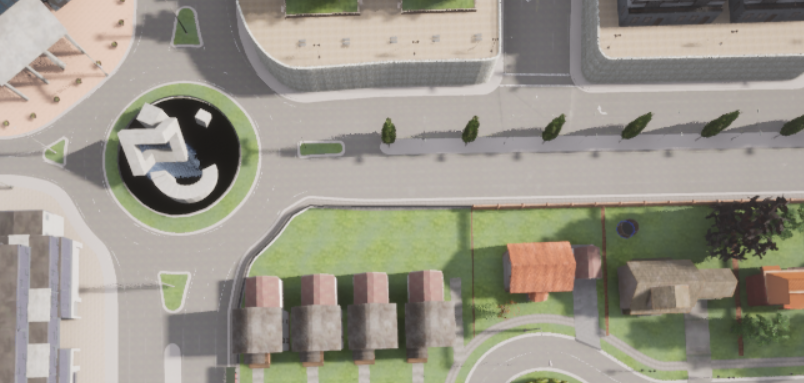
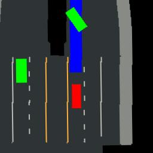
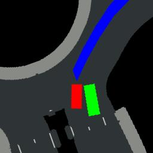
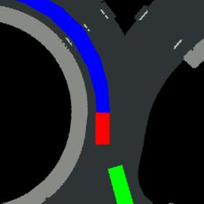
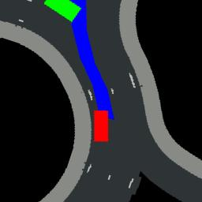

使用sb3的无模型强化学习算法通过gym规范在carla模拟器中端到端的训练小车。 
carla版本为：0.9.13.使用town03地图，选取地图最复杂的圆盘地段。
    
具体实现方式： 
 1.先让一端的小车，携带雷达小车正常行驶收集4万多张bird-view image信息 
 
2.用这些数据训练一个vae网络，学习图片的潜在状态，主要目的是降维。训练好后，只需要encoder部分，用于强化学习过程中。 
3.把训练的vae encoder部分用在强化学习的状态输入部分。在交互的过程中小车获取到bird-view image，bird-view image通过vae encoder
降维，作为强化学习的状态输入，输出动作为车的转向。